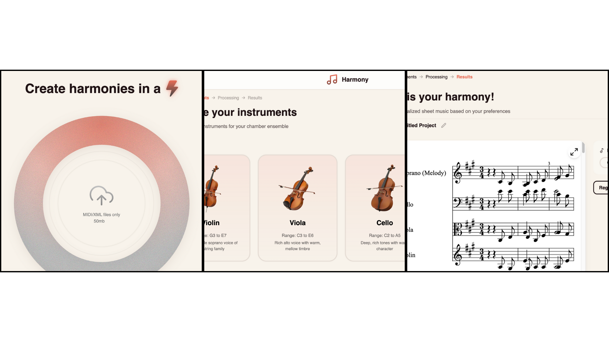
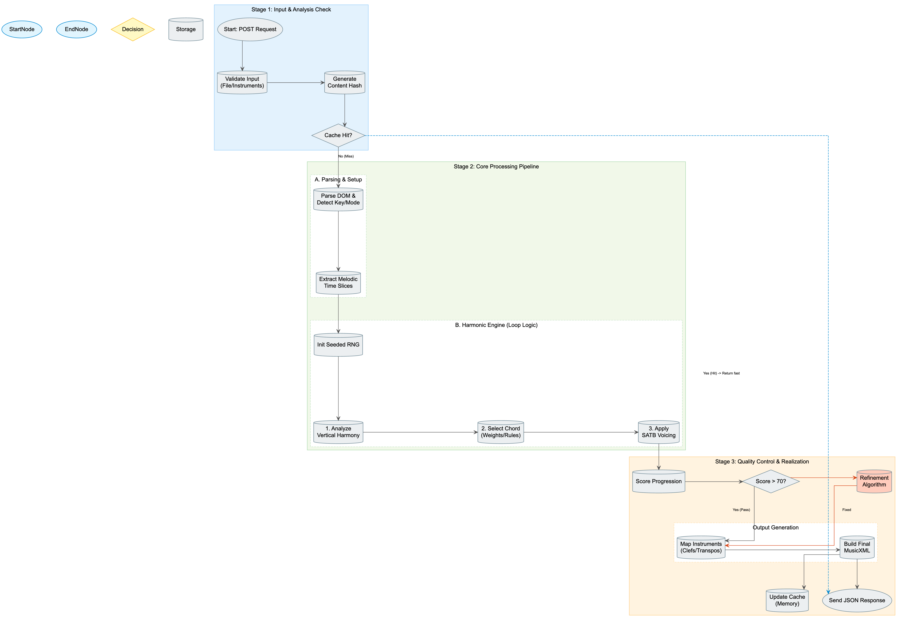
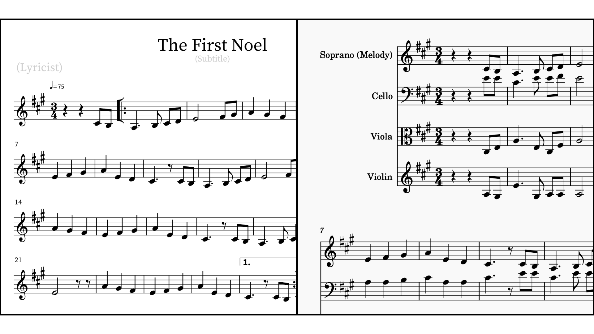

# HarmonyForge: A Co-Creative Approach to Algorithmic Harmonization for String Ensembles

**Authors:**

Dulf Vincent Genis, Shivam Patel, Misha Gandhi, Joanna George

*IS 492 Capstone Project*

*Recent Update: December 10, 2025*

---

## Abstract

Chamber music frequently faces repertoire limitations when sheet music is constrained to solo melodic lines, which prevents full ensemble performance and excludes musicians with less experience. To address this gap, **Harmony Forge** is a rule-based harmonization system capable of generating customizable harmony parts and counterpoint for string ensembles using SATB voice leading and harmonic progression logic. We conducted evaluations with three domain specialists and professionals, in which results showed strong value for gigging musicians, arrangers, and educators. This tool serves as a co-creative assistant that accelerates workflow and expands repertoire. Some harmonies were valid, but some felt rigid due to algorithmic limitations. Findings showcase the importance of iteration, transparency, controls, and user-guided refinement in human-AI collaboration. This report concludes with a discussion on the ethical integration of AI in creative workflows and proposes a hybrid future combining rule-based logic with machine learning to enhance harmonic fidelity.

---

## 1. Introduction

### 1.1 Problem Context

The landscape of musical performance is often divided between the rigid structures of classical repertoire and the flexible demands of the "gigging" economy. Musicians performing at weddings, holiday events, or casual jam sessions frequently encounter a logistical bottleneck: the lack of bespoke arrangements for specific instrumentations. As noted by one professional violinist participant, while standard repertoire is accessible via libraries, specific requests (e.g., a pop song for a string quartet) often require manual arrangement or improvisation, creating a barrier for ensembles that rely on sheet music.

Furthermore, music educators face the challenge of bridging the gap between performance and composition for students. Arranging music requires a deep understanding of voice leading and harmonic function, skills that beginner musicians often lack. This creates an exclusion zone where only those with theoretical training can participate in the creative side of ensemble playing.

The problem extends beyond mere convenience. Research in human-AI co-creation suggests that existing AI music tools often produce "fixed" audio outputs that are "hard to manipulate," preventing users from adjusting individual notes or tracks essential for creating arrangements for specific instruments or skill levels (Fu et al., 2025). Additionally, many systems offer minimal, "1-parameter" interfaces that are insufficient for co-creation, leading users to feel that the generation process is random rather than creative (Tchemeube et al., 2025).

### 1.2 The Harmony Forge Solution

Harmony Forge was developed to address these issues by providing an accessible, web-based tool that automates the generation of accompanying parts. The core value proposition of Harmony Forge is **Creative Efficiency** and **Inclusion**. By automating the tedious aspects of part-writing—such as SATB (Soprano, Alto, Tenor, Bass) voice leading and chord construction—the tool enables musicians to expand their repertoire without the steep learning curve of manual composition.

Unlike diffusion-based generative models that operate as "black boxes," Harmony Forge utilizes a deterministic, rule-based TypeScript engine that prioritizes interpretability and editability. This approach aligns with research on co-creative systems, which emphasizes the importance of maintaining human agency and control in AI-assisted creative workflows (Tchemeube et al., 2025). The system generates MusicXML output, enabling direct integration with standard notation software (Finale, Sibelius, MuseScore), addressing a critical gap identified in validation studies where existing tools failed to produce structured, symbolic outputs suitable for ensemble rehearsal.

### 1.3 Scope of the Report

This report walks through the Harmony Forge project from start to finish—the theory behind it, how we built it, and what we learned from testing it with real musicians. We look at the push and pull between following strict musical rules and creating something that actually sounds good, using feedback from experts to figure out how software can help rather than replace human arrangers. The report covers related work, our system design, evaluation results, limitations, and where we want to take this next.

---

## 2. Related Work & Theoretical Grounding

### 2.1 Classical Music Theory Principles

Harmony Forge uses standard Western tonal harmony rules. We follow the Tonic → Predominant → Dominant → Tonic flow, using the circle of fifths to drive harmonic movement (Hutchinson, 2017). We avoid parallel fifths and octaves (which kill voice independence), prefer stepwise motion, and keep voices properly spaced. Each SATB voice has its range: Soprano (C4-C6), Alto (G3-E5), Tenor (C3-G4), Bass (E2-C4). This keeps parts playable and musically coherent.

### 2.2 Algorithmic vs. Diffusion-Based Generation

There's a big difference between rule-based systems like ours and machine learning approaches. Diffusion models can generate expressive music by learning from huge datasets, but they're black boxes—you can't see why they made a choice (Huang et al., 2024). We went the other way: deterministic rules that you can understand and edit. We lose some nuance but gain transparency and control.

### 2.3 Human-AI Co-Creation in Music

Research shows people want AI tools that help with inspiration and writer's block, but they also need to feel in control and maintain emotional connection to their work (Fu et al., 2025). AI-generated music often lacks "emotional depth" because it's missing the human touch. That's why Harmony Forge is designed as a helper, not a replacement. We handle the tedious stuff (transposition, basic voicing) so musicians can focus on the creative decisions (Tchemeube et al., 2025).

### 2.4 Evaluation of AI Music Systems

AI music tools have come a long way, but they still struggle with making stuff that sounds good and actually works in real workflows. Bad harmonies and awkward voice leading are common problems, and when tools only spit out audio files, you can't edit them—which is a dealbreaker for musicians who need to tweak things. People also feel like they're losing control and ownership over their creative work.

When you only have a single melody line to work with, computational systems can help fill in the gaps, but they shouldn't replace the musician. Rule-based systems get the theory right but sound stiff. Machine learning models can be unpredictable and might just copy their training data. Our work builds on research about human-AI collaboration and what musicians actually want: tools that help them create while keeping them in control.

We tested existing tools (Klangio, Remusic, Suno AI, ElevenLabs) and found they couldn't do what we needed. Transcription tools can't compose new parts. Audio generators make files you can't edit. Most ignore constraints like difficulty level or specific instruments. This is why we focused on making something that outputs editable MusicXML and gives users real control over what gets generated.

---

## 3. Method

### 3.1 System Description

Harmony Forge is a web application designed to intake a single melody line and output a full ensemble arrangement. The system is deployed at https://chamber-music-fullstack-deploy.vercel.app/ and consists of a React/TypeScript frontend and a Node.js backend with a sophisticated harmonization engine.

**Frontend Architecture:** We built the interface with React and Vite, using design tools to quickly prototype a clean dashboard. The frontend structure follows a linear, step-by-step workflow that matches how musicians actually think about arranging: upload a melody, pick your instruments, generate harmonies, then download the results. This sequential design reduces cognitive load—users don't have to figure out what to do next because the path is clear. The drag-and-drop file upload eliminates technical barriers (no need to understand file paths or formats), and the real-time processing feedback keeps users engaged rather than wondering if something broke. The score visualization using OpenSheetMusicDisplay lets users immediately see and evaluate the output, which is crucial for building trust in a system that generates music. This structure aligns with our co-creative philosophy: each step gives users a chance to make decisions and feel in control, rather than just clicking a button and hoping for the best.

*Figure 1: The linear workflow interface guides users through upload, instrument selection, and results visualization, reducing cognitive load and maintaining user control at each step.*

**Backend Harmonization Logic:** The heart of the system is our harmonization engine—about 2,385 lines of TypeScript that turn a melody into full ensemble parts. **We didn't use any machine learning or training data.** Everything runs on deterministic rules: SATB voice leading, harmonic function theory, chord detection, and a seeded random number generator so the same input always gives the same output. The engine works through several stages:

*Figure 2: The harmonization pipeline processes input through analysis, chord generation with SATB voicing rules, and validation before mapping to instrument-specific output.*

1. **Parse & Analyze:** Extract key signature, detect if input is monophonic or polyphonic, and identify the scale.

2. **Extract Melody:** Pull out the melodic line(s) and convert to MIDI pitches with timing information.

3. **Generate Chords:** Figure out appropriate chord functions (tonic, predominant, dominant) based on the melody notes and harmonic flow.

4. **Assign Voices:** Use SATB principles to assign notes to instruments, following voice-leading rules: avoid parallel motion, prefer stepwise motion, resolve tendency tones properly, and keep voices in their ranges.

5. **Generate Parts:** Map voices to specific instruments, apply transpositions and range constraints.

6. **Validate & Refine:** Score the progression (0-100). If it's below 70, try to improve it with better inversions and smoother voice leading.

7. **Output MusicXML:** Generate two files—harmony-only and combined (melody + harmony)—both ready to import into notation software.

**Deterministic Output:** We use a seeded random number generator so the same input always gives the same output. This builds trust and lets users experiment without losing a good result.

**Technical Stack:** React/TypeScript frontend, Node.js/Express backend, deployed on Vercel serverless functions.

### 3.2 Evaluation Design: Conceptual Walkthrough & Self-Guided Exploration

We conducted user studies with three domain experts—a music educator, a songwriter, and a professional violinist—to gather qualitative insights. Rather than assigning specific tasks to measure standard usability metrics, we used a **conceptual walkthrough approach** via live screen-sharing and a guided interview script. This method focused on conceptual validation and co-design input, letting us demonstrate the backend harmonization logic and establish ethical framing.

**Participants:** We recruited three distinct domain experts representing our target user personas:

1. **Professional Violinist (P1):** A conservatory student with extensive chamber music experience, representing the "gigging professional" persona who needs rapid arrangements for performance contexts.

2. **Songwriter/Arranger (P2):** A multi-instrumentalist representing the "gigging/pop" arranger demographic, bringing expertise in contemporary music styles and arrangement workflows.

3. **Music Educator (P3):** An orchestra director with experience in niche genres (Mariachi), representing the educator persona who needs tools that support student learning and diverse repertoire.

*Note: Throughout this report, participants are referenced as P1 (Professional Violinist), P2 (Songwriter/Arranger), and P3 (Music Educator) to maintain anonymity while preserving context.*

**Two-Phase Protocol:**

**Phase 1 - Conceptual Walkthrough:** Remote video sessions with live screen-sharing where we demonstrated the system and walked participants through the harmonization process. We used a guided interview script covering background, initial impressions, harmony feedback, use cases, ethical concerns, and feature requests. This phase focused on understanding the conceptual value of the tool, gathering co-design input, and building trust through transparency about how the system works.

**Phase 2 - Self-Guided Exploration:** After the live demo, participants received the deployable app link and were encouraged to freely explore the tool on their own time without specific prompts or tasks. We intentionally didn't give them a checklist or structured tasks—just the app and the freedom to use it however they wanted. This unstructured approach lets us see how people actually use the tool when no one's watching, revealing natural workflows and unexpected use cases. The initial walkthrough built trust and familiarity, while the free exploration phase captured authentic feedback about real-world usage patterns. We plan to follow up with participants after they've had time to use the app independently to gather additional insights from their unguided experience.

**Data Collection:** Sessions were recorded and transcribed for thematic analysis, focusing on perceived value, control needs, quality concerns, and ethical implications (Tchemeube et al., 2025). The two-phase approach captured both immediate reactions during the walkthrough and more considered feedback from independent exploration.

---

## 4. Results and Analysis

### 4.1 Quantitative Analysis

**Note on Evaluation Approach:** This study prioritized qualitative, conceptual validation over quantitative metrics. We focused on understanding user needs, perceived value, and ethical implications rather than measuring task completion times or error rates. While we collected some technical performance data, these serve as baseline observations rather than rigorous quantitative analysis. Future work will include formal quantitative user studies with larger sample sizes and objective metrics (e.g., SUS scores, task completion rates, harmonic quality metrics like EB, UPC, QN, DP, TD).

**Technical Performance Observations:** The backend successfully implemented core harmonic logic, processing melodies of varying lengths (from 8 bars to 19+ bars) and generating MusicXML output compatible with standard notation software. The system supports 13 different instruments across strings, woodwinds, brass, and voices, and can generate harmonies for ensembles of 1-4 instruments.

**Processing Performance:** The harmonization engine processes typical melodies (8-20 bars) in 1-5 seconds, well within the 60-second Vercel function timeout. The deterministic seed-based approach ensures reproducible results, allowing users to regenerate harmonies with consistent quality.

**Harmonic Validation:** We built a validation system that scores progressions from 0-100, checking chord connectivity, voice leading smoothness, and progression logic. We track parallel motion (should be zero), processing speed (usually 1-5 seconds), and range adherence. Most test runs scored above 70, but when we showed it to real musicians, some harmonies felt "weird" or "off" (P2). The validation system prioritizes following the rules over making things sound natural, which is something we need to fix.

**Output Quality:** The MusicXML files work perfectly in Finale, Sibelius, and MuseScore—all the formatting, labels, and metadata are correct. But the harmonies can sound a bit mechanical. They follow the rules, but they don't always have that human touch that makes music feel alive.

*Figure 3: Transformation from monophonic input ("The First Noel" melody) to full string quartet arrangement, demonstrating the system's ability to generate complementary parts while preserving the original melody.*

### 4.2 Qualitative Insights

The user study yielded rich data regarding the role of AI in music. The feedback is categorized below by user persona.

#### 4.2.1 The Professional Performer

The professional violinist participant, whose role in ensembles is described as a "servant leader," identified a specific, high-value use case: the **Gigging Economy**. This participant noted that while classical repertoire is abundant via IMSLP, custom arrangements for weddings (e.g., pop songs for string quartets) are a major pain point.

**Key Insights:**
- This participant views the app not as a tool for serious classical composition, but as a utility for "jam sessions" and gigs where speed is more important than theoretical perfection.
- The tool addresses a real need: "What happens to all these arrangers?" (P1) the participant asked, expressing concern about displacement, but also acknowledging that the tool fills a gap where manual arrangement is too time-consuming for the context.
- This participant specifically requested "Counterpoint" capabilities, stating that if the app could generate independent melodic lines rather than just block chords, it would be a "game-changer" (P1).

**Ethical Stance:** This participant expressed concern about displacement of professional arrangers, but also recognized that the tool serves a different market (rapid prototyping for gigs) rather than replacing high-end arrangement work. The participant jokingly noted the tool "might be banned" for undergrad theory students (P1), highlighting concerns about academic integrity.

#### 4.2.2 The Songwriter/Arranger

The songwriter participant, who identifies as a "loyal follower" in ensembles but an active arranger, provided critical feedback on the musical output. This participant described the AI-generated harmonies as creating a "second version" of the song—harmonically functional but distinct from the original composer's intent.

**Key Insights:**
- This participant valued the tool as a "starting point" to overcome writer's block, aligning with research findings that AI can serve as an inspiration engine (Fu et al., 2025).
- However, this participant noted that the bass lines often lacked the specific character imagined (P2), suggesting the need for more user control over the "style" of the generation.
- The harmonies sometimes felt "weird" or "off" (P2), indicating that strict adherence to vertical chord construction sometimes compromises the horizontal melodic line.

**Co-Design Feedback:** This participant advocated for a workflow that is not "one-click" but allows for editing between input and output, such as regenerating specific harmonies or defining the genre. The participant emphasized the importance of maintaining creative control and the ability to refine AI output to match artistic vision.

**Ethical Concerns:** This participant raised a concern about using the tool on unreleased music, implying potential intellectual property risks if the AI utilizes user data for training. This highlights the importance of transparent data handling and user control over their creative inputs.

#### 4.2.3 The Educator

The music educator participant provided the most diverse perspective, balancing roles as a performer and a teacher. This participant highlighted the struggle of arranging for **Mariachi** ensembles, where repertoire is not centralized and relies heavily on manual transcription.

**Key Insights:**
- This participant framed the app as a "gateway" for students (P3). By allowing students to dabble in composition without needing years of theory training, the app serves an educational purpose.
- The tool addresses a real need in niche genres (Mariachi) where arrangements are scarce and manual transcription is time-consuming.
- This participant emphasized that the tool should handle the "grunt work" (transposition, basic voicing) while leaving creative decisions to the musician (P3).

**Ethical Stance:** This participant emphasized that AI should remain a "supportive role," never having the "final say" (P3). The participant wants the tool to support learning and creativity without replacing the educational value of understanding music theory. This aligns with research on co-creative systems that emphasize maintaining human agency (Tchemeube et al., 2025).

### 4.3 Discussion: Co-Creative Design Principles

What stands out from talking to these three experts is how consistently they rejected the idea of AI taking over. They didn't want a fully autonomous composer—they wanted a partner. This isn't surprising given what we know about human-AI collaboration, but hearing it directly from people who actually make music for a living makes it real.

The tension between automation and agency came up in different ways for each person, but the core message was the same: give us control, show us what's happening, and let us shape the final product. The songwriter (P2) put it bluntly—being able to regenerate or edit harmonies wasn't optional, it was essential. This aligns with research showing people don't want black boxes; they want to understand and control what's happening (Tchemeube et al., 2025).

What's interesting is how the need for control showed up differently across use cases. The professional violinist (P1) needed speed for gigs, but still wanted counterpoint capabilities—not just block chords. The educator (P3) wanted a "gateway" for students, but emphasized that AI should never have the "final say." The songwriter (P2) wanted a starting point to overcome writer's block, but needed to be able to refine the output to match their artistic vision. Same underlying need, different expressions.

The genre problem is real. We're applying 18th-century classical rules to everything, which makes pop songs sound like Bach and Mariachi arrangements feel wrong. The educator's (P3) struggle with Mariachi arrangements highlights this—we need genre modes that adjust the rules. Maybe allow parallel thirds in some styles, or use different chord progressions for contemporary music. One size definitely doesn't fit all.

Trust is tricky. When harmonies sounded "weird" (P2), it was usually because we prioritized vertical chord correctness over horizontal melodic flow. Our rule-based approach helps people trust the system—at least they know it's following rules, not just making things up—but they also need visibility into why we made certain choices. Transparency builds trust, but only if people can actually understand what they're seeing.

The education question is important. The educator (P3) saw this as a "gateway" for students, which is great, but we need to be careful. It should support learning, not replace it. That means clear guidelines, maybe an educational mode that explains what's happening, and probably some guardrails to prevent it from becoming a homework shortcut.

Looking at the three use cases—gigging musicians who need speed, songwriters looking for inspiration, and educators introducing students to composition—it's clear we can't be everything to everyone. We should probably build for specific workflows rather than trying to create a universal tool. The professional violinist (P1) doesn't need the same features as the educator (P3), and that's okay.

The bigger picture here is that co-creative tools work best when they scaffold creativity rather than replace it. Users want regeneration options, genre rules, chord notation controls, and ways to shape the final product themselves. The AI handles the grunt work; humans make the creative decisions. That's the balance we need to strike.

---

## 5. Limitations, Risks, and Ethical Considerations

Our study has several limitations, risks, and ethical considerations that must be acknowledged.

### 5.1 Sample Size and Generalizability

We only tested with three people, which is pretty small. They gave us great insights, but we can't say our findings apply to everyone. We'd need a bigger, more diverse group—different skill levels, musical backgrounds, and cultural contexts—to really know how well this works across the board.

### 5.2 Technical Limitations

Our rule-based system is pretty rigid. Unlike machine learning models that can learn patterns from data, we're stuck with explicit rules, which creates some problems:

1. **Missing the Big Picture:** We harmonize note-by-note without seeing the bigger phrase structure. The harmonies are correct locally but can feel disconnected across a whole phrase.

2. **Genre Blindness:** We're applying 18th-century rules to everything, which makes pop songs sound like Bach. We need genre modes that adjust the rules.

3. **Block Chords, Not Counterpoint:** We generate mostly block chords rather than independent melodic lines. The professional violinist wanted counterpoint, which we can't do yet.

4. **Non-Chord Tones:** We handle some passing tones and suspensions, but not well enough. Better treatment would make the lines flow more naturally.

5. **Polyphonic Input:** We can handle multiple voices, but our analysis is basic. We could do better at understanding what's happening when multiple notes play at once.

6. **Too Rigid:** Following rules strictly can make things sound mechanical. Sometimes the "correct" answer doesn't sound right to human ears.

### 5.3 Cultural and Musical Bias

We're only using Western music theory—SATB voice leading, functional harmony, the circle of fifths. That doesn't work for non-Western traditions, which limits who can actually use this tool. To make it truly useful globally, we'd need to incorporate principles from other musical traditions.

### 5.4 Ethical Considerations

People were worried about AI taking over creative work, but everyone agreed that tools should support, not replace, human creativity.

**Will This Put Arrangers Out of Work?** The professional violinist (P1) asked what happens to arrangers if software gets too good. The consensus: AI can't replace live performance or the human touch. We're targeting a different market—quick prototypes and educational support, not high-end professional work (Tchemeube et al., 2025).

**Academic Integrity:** Students could use this to cheat on theory homework. One participant (P1) joked it "might be banned" for undergrads. We need to think carefully about how this gets used in education. It should help people learn, not let them skip the hard parts.

**Copyright Issues:** We don't store any personal data—just process files in memory. But users might upload copyrighted melodies, which raises fair use questions. The songwriter (P2) was concerned about using unreleased music. We need clear policies about data usage and copyright, plus educational materials about fair use. If we add machine learning later, we should use techniques like HARMONYCLOAK to protect copyrighted training data (Meerza et al., 2025).

**Authorship and Attribution:** The deterministic, rule-based approach helps maintain transparency about how harmonies are generated, but questions remain about authorship when AI assists in creation. The tool should clearly communicate its role as an assistant rather than a creator, and users should understand their responsibility for the final creative output.

### 5.5 Risks of Homogenization

If everyone gets the same "textbook perfect" harmonies, music starts to sound the same. Our seeded random generator adds some variation, but not enough. We need better ways to let users inject their own style—maybe through user-controllable parameters, genre-specific rules, or learning from how people edit the output.

### 5.6 Ecological Validity

We tested this in a controlled setting with guided walkthroughs. That's not how people actually use tools in the wild. To really understand if this works, we'd need to see how people use it over time in their normal workflows.

### 5.7 Accessibility and Inclusivity

We want to make music arranging accessible, but there are still barriers: you need a computer and internet, some basic music knowledge, and the interface is English-only. If we charge for it later, that's another barrier. We should address these to truly democratize access.

---

## 6. Conclusion and Future Work

### 6.1 Conclusion

Harmony Forge successfully solves a real gap: musicians—especially chamber groups, educators, and gigging performers—need fast, customizable harmonies, and the tool clearly boosts efficiency and accessibility. The user study confirms that the value lies not in the perfection of the output, but in the accessibility it provides—bridging the gap between a solo melody and a full ensemble experience.

**Human Control is Non-Negotiable:** Users want AI support, not AI dominance. Customization, transparency, and editable outputs are the core values. The study shows that musicians trust AI when they stay in the driver's seat. The system works best as a co-creative assistant: generating ideas, accelerating arrangement workflows, and lowering the barrier for beginners, while letting humans refine style, taste, and musical decisions. It highlights that AI should scaffold creativity, not replace it—users want regeneration options, genre rules, chord notation, and melody distribution to shape the final product themselves.

The system addresses critical gaps identified in validation studies: it produces structured, symbolic output (MusicXML) rather than fixed audio files, provides deterministic and interpretable generation rather than "black box" outputs, and offers fine-grained control over instrumentation and basic harmonic parameters. However, the user study also revealed limitations: the system needs better genre awareness, counterpoint capabilities, and more sophisticated handling of musical context.

The ethical considerations raised by participants highlight the importance of designing AI tools that support rather than replace human creativity. The tool should maintain transparency, respect user agency, and be designed with clear use cases and limitations in mind. Educational use requires particular care to ensure the tool supports learning rather than bypassing it.

### 6.2 Future Work

To address the limitations identified, future development will focus on:

**Technical:** We need better music theory guardrails—catching parallel motion, improving cadences, cleaning up voice-leading. We also want counterpoint generation (independent melodic lines, not just block chords) and eventually hybrid ML models for stylistic nuance while keeping the rule-based engine for correctness. Genre customization is crucial—different styles need different rules.

**User Experience:** Better onboarding so people don't get overwhelmed. Make customization controls more obvious upfront. Add an in-browser editor for iterative refinement. Create an educational mode that explains what's happening.

**Data & Deployment:** Better metadata extraction to improve harmonic quality. Support for underrepresented genres like mariachi. PDF/image scanning for physical sheet music. Audio playback and project saving for real workflows.

**Accessibility:** Multi-language support, mobile responsiveness, clear data policies, and educational guidelines.

These changes would turn Harmony Forge from a proof-of-concept into something people actually use daily, while keeping the human-centered approach that makes it valuable.

---

## 7. References

De Haas, W. B., Veltkamp, R. C., & Wiering, F. (2008). Tonal pitch step distance: A similarity measure for chord progressions. In ISMIR. https://dspace-acc.library.uu.nl/handle/1874/32376

Fu, Y., Newman, M., Going, L., Feng, Q., & Lee, J. H. (2025, July). Exploring the Collaborative Co-Creation Process with AI: A Case Study in Novice Music Production. In Proceedings of the 2025 ACM Designing Interactive Systems Conference (pp. 1298-1312). https://doi.org/10.1145/3715336.3735829

Huang, Y., Ghatare, A., Liu, Y., Hu, Z., Zhang, Q., Sastry, C. S., ... & Yue, Y. (2024). Symbolic music generation with non-differentiable rule guided diffusion. arXiv preprint arXiv:2402.14285. https://doi.org/10.5555/3692070.3692866

Hutchinson, R. (2017). Music Theory for the 21st-Century Classroom. https://musictheory.pugetsound.edu/

Meerza, S. I. A., Sun, L., & Liu, J. (2025, May). Harmonycloak: Making music unlearnable for generative ai. In 2025 IEEE Symposium on Security and Privacy (SP) (pp. 430-448). IEEE. https://doi.org/10.1109/SP61157.2025.00085

Tchemeube, R. B., Ens, J., Plut, C., Pasquier, P., Safi, M., Grabit, Y., & Rolland, J. B. (2025). Evaluating human-AI interaction via usability, user experience and acceptance measures for MMM-c: A creative AI system for music composition. arXiv preprint arXiv:2504.14071. https://arxiv.org/abs/2504.14071

Miller, J., Pauwels, J., & Sandler, M. (2023). Polar Manhattan Displacement: measuring tonal distances between chords based on intervallic content. https://ismir2023program.ismir.net/poster_294.html

---

## Appendices

### Appendix A: Study Materials & Prompts

**User Study Protocol:**

Semi-structured interviews covering: background (ensemble experience, repertoire challenges), app interaction (upload melody, select instruments, review output), feedback (thoughts on harmony, comparison to existing arrangements, desired changes, use cases), ethical concerns (AI in music, displacement, authorship), and feature requests.

All participants provided informed consent, sessions were recorded for transcription, and feedback was used in this report.

### Appendix B: Technical Stack Attribution

Development used GitHub Copilot, AI Cursor, V0.dev, Vercel, Google Gemini Nano, Claude AI, and NotebookLM for code generation, design, deployment, and documentation. All AI-generated content was reviewed and edited by human authors.

### Appendix C: Team Contributions & Acknowledgments

**Dulf Vincent Genis:**
- Backend harmonizer logic implementation
- System debugging and optimization
- User study pilot and protocol development

**Shivam Patel:**
- Frontend architecture and design
- Deployment infrastructure
- Task delegation and project coordination

**Misha Gandhi:**
- Repository management and organization
- Final presentation development
- Report outline and structure

**Joanna George:**
- Repository management
- Presentation development
- Documentation coordination

**Acknowledgments:**
The team would like to thank the three domain expert participants who provided invaluable feedback during the user study. Their insights shaped the development of Harmony Forge and highlighted the importance of human-centered design in AI-assisted creative tools.

### Appendix D: System Architecture Details

**Live Application:** https://chamber-music-fullstack-deploy.vercel.app/

**Technical Specs:** Supports MIDI/MusicXML input, generates MusicXML output. Max file size 50MB, up to 4 instruments, processing time 1-5 seconds typically. Core engine: 2,385 lines of TypeScript in `harmonize-core.ts`.

**Validation Results:** Testing existing tools (Klangio, Remusic, Suno AI, ElevenLabs) showed they couldn't generate editable symbolic output or compose new parts. Harmony Forge addresses these gaps with MusicXML generation and rule-based harmonization.